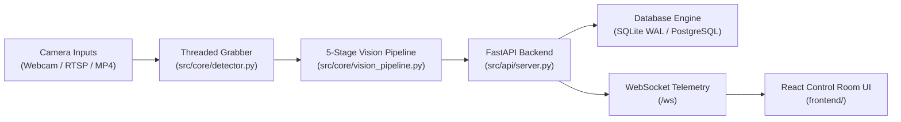

# 🛡️ Cerberus AI — Industrial PPE Compliance & Safety Intelligence Platform

[](https://github.com/sowmiyan-s/ppe-detection-yolo)
[](https://fastapi.tiangolo.com)
[](https://www.python.org)
[](https://ultralytics.com)
[](https://react.dev)
[](https://www.sqlite.org)
[](LICENSE)

**Cerberus AI** is an enterprise-grade Edge AI computer vision platform designed for continuous, multi-camera Personal Protective Equipment (PPE) compliance monitoring and safety telemetry. Engineered for manufacturing plant floors, hazardous industrial sites, and high-altitude construction platforms, the platform combines custom-trained YOLOv8/v11 models, ByteTrack worker tracking, temporal noise suppression, and high-frequency WebSocket streaming.

Official Repository: [https://github.com/sowmiyan-s/ppe-detection-yolo](https://github.com/sowmiyan-s/ppe-detection-yolo)

---

## 📚 Technical Documentation Suite

| Document | Category | Key Topics Covered |
| :--- | :--- | :--- |
| 🏗️ [System Architecture](docs/architecture.md) | System Design | 5-stage vision pipeline, ByteTrack tracking, concurrency model & data flow |
| ⚡ [Performance & Multi-Cam Optimization](docs/performance_optimization.md) | Performance | Thread isolation, adaptive resolution ladder, and 12–16+ multi-stream scaling |
| 📡 [REST & WebSocket API Reference](docs/api_documentation.md) | Integration | Full endpoint specs, WebSocket telemetry payloads, and schema definitions |
| 📊 [Hardware Benchmark Report](docs/benchmark_report.md) | Telemetry | Jetson Orin Nano, AGX Orin, RTX GPUs, and CPU fallback throughput metrics |
| 🎯 [Model Accuracy & Evaluation](docs/accuracy_report.md) | Machine Learning | 19-class precision, recall, mAP@50, and environmental robustness tests |
| 🚀 [NVIDIA Jetson Setup Guide](docs/jetson_setup.md) | Edge Deployment | JetPack 6.x configuration, power modes, and systemd service automation |
| ⚡ [TensorRT Acceleration Guide](docs/TENSORRT_GUIDE.md) | Optimization | FP16/INT8 compilation, calibration pipelines, and ONNX export |
| 🏷️ [Dataset & Labelling Guide](docs/dataset_guide.md) | Dataset | 19-class industrial taxonomy, augmentation, and YOLO directory layout |
| 🎬 [Demonstration & Walkthrough](docs/demo_guide.md) | Operations | End-to-end control room walkthrough and CLI validation scripts |
| 📖 [Operational User Guide](docs/user_guide.md) | SOP | Operator guide for live triage, zone assignment, and audit reporting |
| 🖥️ [Frontend Dashboard Guide](frontend/README.md) | Web Engineering | React 19, TanStack Start/Router, dark theme telemetry UI |
| 🎯 [Model Training Guide](training/README.md) | ML Engineering | Workstation, Kaggle GPU, and Google Colab model training pipelines |

---

## 🌟 Core Capabilities

- **⚡ Multi-Stream Concurrent Vision Engine:** Seamlessly processes USB webcams, RTSP streams, IP cameras, local MP4 video files, and YouTube Live streams simultaneously.
- **🧠 5-Stage Vision & Verification Pipeline:** 
  1. Person Tracking (`ByteTrack` persistent worker IDs)
  2. Multi-Class PPE Detection (`YOLOv8` 19-class detector)
  3. Spatial Association (Head, torso, foot anatomical containment heuristics)
  4. Per-Zone Rule Engine (Custom PPE requirements per hazard level)
  5. Temporal Noise Suppression ($\ge 8/10$ window with a 2-second dwell floor to prevent single-frame false alerts)
- **👥 Worker Compliance & Proof Management:** Individual worker scorecards with direct visual evidence snapshot previews, selective multi-item violation purging, dispute resolution workflows, and compliance recalculation.
- **📊 Real-Time Hardware Telemetry & Capacity Intelligence:** Live monitoring of CPU utilization, system RAM, GPU VRAM allocation, and automatic calculation of extra webcam headroom (+10 to +15 cameras on modern GPUs/Jetson).
- **💾 Dual-Engine High-Throughput Persistence:** SQLite WAL mode with sub-millisecond query caching and optional PostgreSQL sync.
- **💻 Industrial Dark-Mode Control Room UI:** Built with React 19, TanStack Start, Tailwind CSS v4, and Recharts for live WebSocket telemetry feeds.

---

## 🏗️ System Architecture



---

## 🚀 Quick Start

### 1. Prerequisites
- **Python:** `3.10` or higher
- **Node.js:** `v18.0.0+` & `npm`
- **Hardware (Optional):** NVIDIA GPU with CUDA 12.x / NVIDIA Jetson Orin (CPU fallback fully supported).

### 2. One-Click Launch (Windows)
Run the automated launcher:
```cmd
start_fullstack.bat
```
- **Backend API & WebSockets:** `http://localhost:8000` (Interactive docs at `http://localhost:8000/docs`)
- **React Control Room Dashboard:** `http://localhost:5173`

### 3. Manual Installation & Startup

#### Backend Setup
```bash
# Clone the repository
git clone https://github.com/sowmiyan-s/ppe-detection-yolo.git
cd ppe-detection-yolo

# Install Python dependencies
pip install -r requirements.txt

# Start FastAPI server
python -m src.api.server
```

#### Frontend Setup
```bash
cd frontend
npm install
npm run dev
```

---

## 🧪 Automated Testing

Execute the automated test suite covering the rule engine, worker tracker, temporal validation, and database operations:

```bash
pytest
```

To run individual test modules:
```bash
pytest tests/test_rule_engine.py
pytest tests/test_temporal_validator.py
```

---

## 🏷️ Configured 19-Class Taxonomy

The YOLOv8 detection engine is trained on 19 distinct industrial classes:

```
[0] Boots             [5] Mask                 [10] No-Helmet           [15] Circular_Saw
[1] Ear-Protection    [6] No-Boots             [11] No-Mask             [16] Fire_Extinguisher
[2] Glass             [7] No-Ear-Protection    [12] No-Vest             [17] Fire_prevention_Net
[3] Glove             [8] No-Glass             [13] Worker              [18] Welding_Equipment
[4] Hard_hat          [9] No-Glove             [14] Vest
```

---

## 📜 License & Compliance

Released under the **MIT License** — see [LICENSE](LICENSE). Engineered for enterprise industrial operations adhering to **OSHA 1910.132** and **ISO 45001** occupational health and safety standards.
