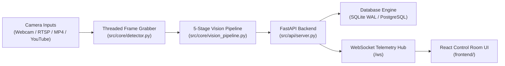

# 🛡️ Cerberus AI — Industrial PPE Compliance & Safety Intelligence Platform

[](https://github.com/Vidhyasree14/Cerberus-AI)
[](https://fastapi.tiangolo.com)
[](https://www.python.org)
[](https://ultralytics.com)
[](https://react.dev)
[](https://www.sqlite.org)
[](LICENSE)

**Cerberus AI** is an enterprise-grade Edge AI computer vision platform engineered for continuous, multi-camera Personal Protective Equipment (PPE) compliance monitoring and real-time safety telemetry. Designed for manufacturing plant floors, hazardous industrial sites, and high-altitude construction platforms, the platform fuses custom-trained YOLOv8/v11 models, ByteTrack persistent worker tracking, temporal noise suppression, and high-frequency WebSocket streaming into a seamless control room experience.

> **Official Repository:** [https://github.com/Vidhyasree14/Cerberus-AI](https://github.com/Vidhyasree14/Cerberus-AI)
>
> **Developer:** Vidhyashree M

---

## 📚 Technical Documentation Suite

| Document | Category | Key Topics Covered |
| :--- | :--- | :--- |
| 🏗️ [System Architecture](docs/architecture.md) | System Design | 5-stage vision pipeline, ByteTrack tracking, concurrency model & data flow |
| ⚡ [Performance & Multi-Cam Optimization](docs/performance_optimization.md) | Performance | Thread isolation, adaptive resolution ladder, and 12–16+ multi-stream scaling |
| 📡 [REST & WebSocket API Reference](docs/api_documentation.md) | Integration | Full endpoint specs, WebSocket telemetry payloads, and schema definitions |
| 📊 [Hardware Benchmark Report](docs/benchmark_report.md) | Telemetry | Jetson Orin Nano, AGX Orin, RTX GPUs, and CPU fallback throughput metrics |
| 🎯 [Model Accuracy & Evaluation](docs/accuracy_report.md) | Machine Learning | 19-class precision, recall, mAP@50, and environmental robustness tests |
| 🚀 [NVIDIA Jetson Setup Guide](docs/jetson_setup.md) | Edge Deployment | JetPack 6.x configuration, power modes, and systemd service automation |
| ⚡ [TensorRT Acceleration Guide](docs/TENSORRT_GUIDE.md) | Optimization | FP16/INT8 compilation, calibration pipelines, and ONNX export |
| 🏷️ [Dataset & Labelling Guide](docs/dataset_guide.md) | Dataset | 19-class industrial taxonomy, augmentation, and YOLO directory layout |
| 🎬 [Demonstration & Walkthrough](docs/demo_guide.md) | Operations | End-to-end control room walkthrough and CLI validation scripts |
| 📖 [Operational User Guide](docs/user_guide.md) | SOP | Operator guide for live triage, zone assignment, and audit reporting |
| 🖥️ [Frontend Dashboard Guide](frontend/README.md) | Web Engineering | React 19, TanStack Start/Router, dark theme telemetry UI |
| 🎯 [Model Training Guide](training/README.md) | ML Engineering | Workstation, Kaggle GPU, and Google Colab model training pipelines |

---

## 🌟 Core Capabilities

- **⚡ Multi-Stream Concurrent Vision Engine:** Simultaneously processes USB webcams, RTSP streams, IP cameras, local MP4 video files, and YouTube Live streams.
- **🧠 5-Stage Vision & Verification Pipeline:**
  1. Person Tracking (`ByteTrack` — persistent `Worker-ID` assignment)
  2. Multi-Class PPE Detection (`YOLOv8` 19-class industrial detector)
  3. Spatial Association (Head, torso, and foot anatomical containment heuristics)
  4. Per-Zone Rule Engine (Configurable PPE requirements per hazard zone)
  5. Temporal Noise Suppression (≥ 8/10 sliding window + 2-second dwell floor to eliminate single-frame false alerts)
- **👥 Worker Compliance & Proof Management:** Individual worker scorecards with visual evidence snapshot previews, selective multi-item violation purging, dispute resolution workflows, and compliance auto-recalculation.
- **📊 Real-Time Hardware Telemetry & Capacity Intelligence:** Live monitoring of CPU utilization, system RAM, GPU VRAM allocation, and automatic calculation of extra webcam headroom (+10 to +15 cameras on modern GPUs or Jetson modules).
- **💾 Dual-Engine High-Throughput Persistence:** SQLite WAL mode with sub-millisecond query caching and optional PostgreSQL sync for enterprise deployments.
- **💻 Industrial Dark-Mode Control Room UI:** Built with React 19, TanStack Start, Tailwind CSS v4, and Recharts for live WebSocket telemetry feeds and compliance trend visualizations.
- **🔒 Regulatory Alignment:** Designed to support **OSHA 1910.132** PPE usage requirements and **ISO 45001** occupational health and safety management standards.

---

## 🏗️ System Architecture



> For a deep-dive into each pipeline stage, see the [System Architecture Guide](docs/architecture.md).

---

## 🚀 Quick Start

### 1. Prerequisites

| Requirement | Minimum Version |
| :--- | :--- |
| **Python** | `3.10+` |
| **Node.js** | `v18.0.0+` |
| **npm** | `v9+` |
| **GPU (Optional)** | NVIDIA CUDA 12.x — CPU fallback fully supported |
| **YOLO Weights** | Place `best.pt` into `models/` |

### 2. One-Click Launch (Windows)

```cmd
start_fullstack.bat
```

| Service | URL |
| :--- | :--- |
| **FastAPI Backend + Interactive Docs** | `http://localhost:8000` / `http://localhost:8000/docs` |
| **React Control Room Dashboard** | `http://localhost:5173` |

### 3. Manual Installation & Startup

#### Backend Setup
```bash
# Clone the repository
git clone https://github.com/Vidhyasree14/Cerberus-AI.git
cd Cerberus-AI

# Install Python dependencies
pip install -r requirements.txt

# Start FastAPI server
python -m src.api.server
```

#### Frontend Setup
```bash
cd frontend
npm install
npm run dev
```

---

## 🧪 Automated Testing

Execute the automated test suite covering the rule engine, worker tracker, temporal validator, and database operations:

```bash
pytest
```

Run individual test modules:
```bash
pytest tests/test_rule_engine.py
pytest tests/test_temporal_validator.py
```

---

## 🏷️ Configured 19-Class Taxonomy

The YOLOv8 detection engine is custom-trained on 19 distinct industrial object and violation classes across three functional categories:

| Class ID | Class Name | Category | Class ID | Class Name | Category |
| :---: | :--- | :--- | :---: | :--- | :--- |
| `0` | `Boots` | ✅ Compliant PPE | `10` | `No-Helmet` | 🚨 Violation State |
| `1` | `Ear-Protection` | ✅ Compliant PPE | `11` | `No-Mask` | 🚨 Violation State |
| `2` | `Glass` | ✅ Compliant PPE | `12` | `No-Vest` | 🚨 Violation State |
| `3` | `Glove` | ✅ Compliant PPE | `13` | `Worker` | 👷 Core Subject |
| `4` | `Hard_hat` | ✅ Compliant PPE | `14` | `Vest` | ✅ Compliant PPE |
| `5` | `Mask` | ✅ Compliant PPE | `15` | `Circular_Saw` | ⚙️ Equipment Hazard |
| `6` | `No-Boots` | 🚨 Violation State | `16` | `Fire_Extinguisher` | 🔴 Safety Equipment |
| `7` | `No-Ear-Protection` | 🚨 Violation State | `17` | `Fire_prevention_Net` | 🔴 Safety Equipment |
| `8` | `No-Glass` | 🚨 Violation State | `18` | `Welding_Equipment` | ⚙️ Hot-Work Hazard |
| `9` | `No-Glove` | 🚨 Violation State | | | |

> **Overall Model mAP@50: 88.5%** — See the full [Accuracy & Evaluation Report](docs/accuracy_report.md) for class-by-class breakdown.

---

## 🐳 Docker Deployment

Build and run using Docker Compose (backend + frontend + nginx proxy):

```bash
docker-compose up --build
```

For production with environment-specific nginx configuration:
```bash
export BACKEND_HOST=localhost
export BACKEND_PORT=8000
docker-compose -f docker-compose.yml up -d
```

---

## 📁 Project Structure

```
Cerberus-AI/
├── src/
│   ├── api/
│   │   └── server.py              # FastAPI application, REST & WebSocket endpoints
│   └── core/
│       ├── detector.py            # ThreadedCamera grabber & multi-stream orchestrator
│       ├── vision_pipeline.py     # 5-stage inference & verification pipeline
│       ├── worker_tracker.py      # ByteTrack-based persistent worker ID management
│       ├── rule_engine.py         # Per-zone PPE requirement evaluation engine
│       ├── temporal_validator.py  # Sliding-window noise suppression (8/10 + 2s dwell)
│       ├── association.py         # Anatomical PPE-to-worker spatial mapping
│       ├── db.py                  # Async database ORM and persistence layer
│       ├── sqlite_db.py           # SQLite WAL + in-memory cache implementation
│       ├── device_telemetry.py    # CPU / RAM / GPU / Jetson hardware metrics
│       ├── cache.py               # Tag-based query result caching
│       ├── config.py              # Global platform configuration and constants
│       ├── enhancer.py            # Frame preprocessing and contrast enhancement
│       └── publisher.py           # WebSocket broadcast hub
├── frontend/                      # React 19 + TanStack Start control room SPA
├── training/                      # YOLO model training scripts and configurations
├── docs/                          # Complete technical documentation suite
├── models/                        # Pre-trained YOLO weights (best.pt / best.engine)
├── database/                      # SQLite database storage
├── scripts/                       # TensorRT export, ONNX conversion utilities
├── tests/                         # Automated pytest test suite
├── deploy/                        # Production systemd and deployment configurations
├── requirements.txt               # Python dependency manifest
├── docker-compose.yml             # Full-stack container orchestration
├── start_fullstack.bat            # Windows one-click launcher
└── data.yaml                      # YOLO 19-class dataset configuration
```

---

## 📜 License & Compliance

Released under the **MIT License** — see [LICENSE](LICENSE).

Engineered for enterprise industrial operations adhering to **OSHA 1910.132** and **ISO 45001** occupational health and safety management standards.

---

## 👩‍💻 Developer

**Cerberus AI** is developed and maintained by **Vidhyashree M**.

- 🔗 **GitHub:** [https://github.com/Vidhyasree14/Cerberus-AI](https://github.com/Vidhyasree14/Cerberus-AI)
