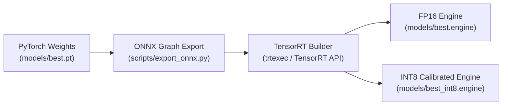

# ⚡ NVIDIA TensorRT Engine Compilation & Optimization Guide

> **Repository:** [https://github.com/Vidhyasree14/Cerberus-AI](https://github.com/Vidhyasree14/Cerberus-AI) | **Developer:** Vidhyashree M

This guide details how to export, compile, and validate NVIDIA TensorRT FP16 and INT8 quantized execution engines for **Cerberus AI**, achieving up to 3.6× inference throughput improvements over native PyTorch.

---

## 📋 Prerequisites

| Requirement | Minimum Version |
| :--- | :--- |
| **NVIDIA GPU** | Any CUDA-capable GPU (Jetson or discrete) |
| **CUDA Toolkit** | 12.2+ |
| **TensorRT** | 10.x |
| **Ultralytics** | 8.x |
| **PyTorch YOLO Weights** | `models/best.pt` |

---

## ⚙️ Compilation Pipeline



---

## 🛠️ Step-by-Step Engine Generation

### Step 1: Export PyTorch to ONNX Intermediate Representation

```bash
python scripts/export_onnx.py \
    --model models/best.pt \
    --imgsz 640 \
    --dynamic False
```

*Output: `models/best.onnx`*

Verify the exported ONNX graph:
```bash
python -c "import onnx; model = onnx.load('models/best.onnx'); onnx.checker.check_model(model); print('ONNX graph valid ✅')"
```

---

### Step 2: Build FP16 Half-Precision TensorRT Engine

FP16 utilizes NVIDIA Tensor Cores, delivering over **2.3× throughput speedup** with negligible mAP impact (< 0.1%):

```bash
python scripts/export_tensorrt.py \
    --model models/best.pt \
    --imgsz 640 \
    --half \
    --device 0
```

*Output: `models/best.engine`*

> This step may take **5–20 minutes** on first run as TensorRT optimizes layer fusion and kernel selection for your specific GPU architecture.

---

### Step 3: Quantized INT8 Engine Compilation (Ultra-High Throughput)

For high-density surveillance setups requiring **3.6× acceleration** over FP32 PyTorch:

**3a. Prepare 200 representative calibration images:**
```
datasets/calibration/images/
├── site_frame_001.jpg
├── site_frame_002.jpg
└── ... (200 diverse industrial scene images)
```

**3b. Generate INT8 engine with entropy calibration:**
```bash
python scripts/export_tensorrt.py \
    --model models/best.pt \
    --imgsz 640 \
    --int8 \
    --calib_data datasets/calibration \
    --device 0
```

*Output: `models/best_int8.engine`*

> **Calibration Images:** Use representative frames from your actual deployment site for best accuracy retention. Avoid using pure training data for calibration.

---

### Step 4: Verify Engine Performance

Benchmark the compiled engine against the original PyTorch weights:

```bash
# Benchmark FP16 TensorRT engine
python scripts/benchmark_engine.py \
    --engine models/best.engine \
    --imgsz 640 \
    --runs 500

# Benchmark INT8 TensorRT engine
python scripts/benchmark_engine.py \
    --engine models/best_int8.engine \
    --imgsz 640 \
    --runs 500
```

---

## 📊 Precision & Throughput Comparison

| Engine Format | Memory Footprint | Inference Latency<br>(Jetson Orin Nano) | mAP@50 Impact | Calibration Required |
| :--- | :---: | :---: | :---: | :---: |
| **FP32 (PyTorch)** | ~45 MB | 28.5 ms | Baseline (0.0%) | No |
| **FP16 (TensorRT)** | ~22 MB | **12.2 ms (2.3×)** | < 0.1% | No |
| **INT8 (TensorRT)** | ~12 MB | **7.8 ms (3.6×)** | ~0.8% | Yes (200 images) |

### RTX GPU Comparison

| Engine Format | Inference Latency<br>(RTX 4070) | Approximate FPS |
| :--- | :---: | :---: |
| **FP32 (PyTorch)** | 18.2 ms | ~55 FPS |
| **FP16 (TensorRT)** | 7.8 ms | ~128 FPS |
| **INT8 (TensorRT)** | 5.1 ms | ~196 FPS |

---

## 🔄 Using Compiled Engines in Cerberus AI

The platform automatically loads a TensorRT engine if it is present, falling back to PyTorch:

```python
# Automatic engine selection in src/core/config.py
# Priority: best.engine → best_int8.engine → best.pt
MODEL_PATH = "models/best.engine"   # TensorRT FP16 (recommended)
# MODEL_PATH = "models/best_int8.engine"  # INT8 ultra-high throughput
# MODEL_PATH = "models/best.pt"          # PyTorch fallback
```

---

## ⚠️ Important Notes

> [!WARNING]
> TensorRT engines are **device-specific**. An engine compiled on a GTX 1650 **will not work** on a Jetson Orin or an RTX 4070. Always recompile directly on the target deployment device.

> [!NOTE]
> On NVIDIA Jetson hardware, the engine compilation step must be run **on the Jetson itself**, not cross-compiled on a desktop machine.

> [!TIP]
> Engine files are large (~20–45 MB). Add `models/*.engine` to `.gitignore` and distribute them separately from the model weights.

---

*Part of the [Cerberus AI](https://github.com/Vidhyasree14/Cerberus-AI) platform — developed by Vidhyashree M.*
