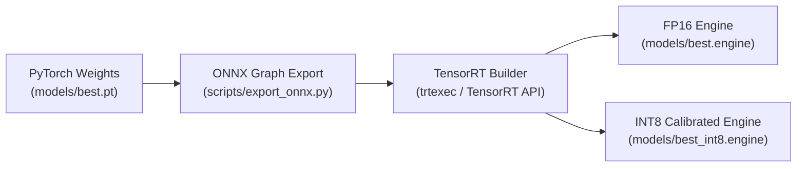

# ⚡ NVIDIA TensorRT Engine Compilation & Optimization Guide

This guide details how to export, compile, and validate NVIDIA TensorRT FP16 and INT8 quantized execution engines for **Cerberus AI**.

---

## ⚙️ Compilation Pipeline



---

## 🛠️ Step-by-Step Engine Generation

### Step 1: Export PyTorch to ONNX Intermediate Representation
```bash
python scripts/export_onnx.py \
    --model models/best.pt \
    --imgsz 640 \
    --dynamic False
```
*Output: `models/best.onnx`*

---

### Step 2: Build FP16 Half-Precision TensorRT Engine
FP16 utilizes NVIDIA Tensor Cores, delivering over $2.1\times$ throughput speedup with negligible mAP impact:
```bash
python scripts/export_tensorrt.py \
    --model models/best.pt \
    --imgsz 640 \
    --half \
    --device 0
```
*Output: `models/best.engine`*

---

### Step 3: Quantized INT8 Engine Compilation (Ultra-High Throughput)
For high-density surveillance setups requiring $3.5\times$ acceleration:

1. Prepare 200 representative site images in `datasets/calibration/images/`.
2. Generate INT8 engine with entropy calibration:
   ```bash
   python scripts/export_tensorrt.py \
       --model models/best.pt \
       --imgsz 640 \
       --int8 \
       --calib_data datasets/calibration \
       --device 0
   ```

---

## 📊 Precision & Throughput Comparison

| Engine Format | Memory Footprint | Inference Latency (Jetson Orin) | mAP@50 Impact | Calibration Required |
| :--- | :---: | :---: | :---: | :---: |
| **FP32 (PyTorch)** | $\approx 45\text{ MB}$ | $28.5\text{ ms}$ | Baseline ($0.0\%$) | No |
| **FP16 (TensorRT)** | $\approx 22\text{ MB}$ | **$12.2\text{ ms}$ ($2.3\times$)** | $< 0.1\%$ | No |
| **INT8 (TensorRT)** | $\approx 12\text{ MB}$ | **$7.8\text{ ms}$ ($3.6\times$)** | $\approx 0.8\%$ | Yes (200 images) |
