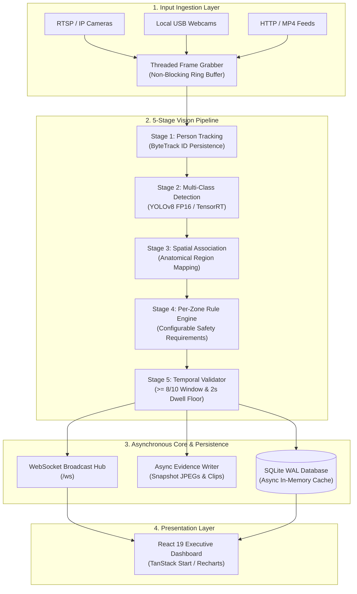

# 🏗️ Cerberus AI — System Architecture & Pipeline Design

Cerberus AI is an industrial edge computer vision platform architected for resilient, multi-camera PPE compliance monitoring. The platform processes continuous video streams through a modular 5-stage inference and temporal verification pipeline, serving low-latency telemetry to a React control room dashboard via FastAPI WebSockets.

---

## 📐 High-Level Architecture



---

## 🧩 Deep Dive into Pipeline Stages

### 1. Ingestion & Resilient Frame Acquisition (`ThreadedCamera`)
- **Non-blocking Grabber Thread:** Each camera feed runs in an isolated daemon thread, decoupling slow network I/O from AI inference.
- **Auto-Recovery Loop:** Automatically handles RTSP packet loss, socket resets, and stream stalls with exponential backoff.
- **Adaptive Frame Rate Decimation:** Implements frame skipping when GPU or CPU load increases, preserving steady video throughput.

### 2. Stage 1 — Person Tracking (`ByteTrack`)
- Assigns persistent tracking IDs (`Worker-101`, `Worker-102`) using motion association (Kalman filter) and bounding box IoU overlap.
- Tracks workers through temporary visual occlusions, camera pan movements, and industrial equipment crossover.

### 3. Stage 2 — Multi-Class PPE Detection (`YOLOv8`)
- Evaluates full frames and cropped worker ROIs across 19 industrial object and violation classes.
- Supports native PyTorch FP32/FP16 execution and compiled TensorRT engines for sub-15ms inference latency.

### 4. Stage 3 — Anatomical Spatial Association
- Maps detected PPE items to worker bounding boxes using anatomical body-region heuristics:
  - **Head Region ($0.0 - 0.28\times \text{height}$):** Helmets, Hard Hats, Face Masks, Safety Glasses, Ear Protection.
  - **Torso Region ($0.25 - 0.65\times \text{height}$):** High-Visibility Reflective Vests, Safety Harnesses.
  - **Lower Body / Feet ($0.65 - 1.0\times \text{height}$):** Safety Boots, Work Gloves.
- Cross-references positive detections (e.g., `Hard_hat`) against negative states (`No-Helmet`).

### 5. Stage 4 — Per-Zone Rule Engine (`RuleEngine`)
- Configurable per-zone compliance matrices (e.g., `General Plant`, `Construction Zone`, `Work at Height`).
- Compares detected worker PPE against active zone requirements to derive immediate violation candidates.

### 6. Stage 5 — Temporal Noise Suppression (`TemporalValidator`)
- Prevents false alarms caused by lighting glare, transient angles, or brief occlusions:
  - Requires a violation candidate to persist across $\ge 8$ out of 10 consecutive frames.
  - Enforces a minimum 2-second dwell time before triggering a formal alarm and logging DB evidence.

---

## ⚡ Concurrency & Thread Isolation Model

Cerberus AI uses separated ThreadPoolExecutors to ensure disk operations and database writes never starve live inference:
- **`_INFER_EXECUTOR`:** Dedicated to model forward passes and ByteTrack updates.
- **`_IO_EXECUTOR`:** Dedicated to background JPEG encoding, MP4 evidence generation, and database sync.

```
[Camera Stream 1] ───┐
[Camera Stream 2] ───┼──► [_INFER_EXECUTOR] ──► Real-time Detections & Tracking
[Camera Stream N] ───┘                                │
                                                       ▼
                                              [_IO_EXECUTOR] ──► Disk / DB / Evidence
```
