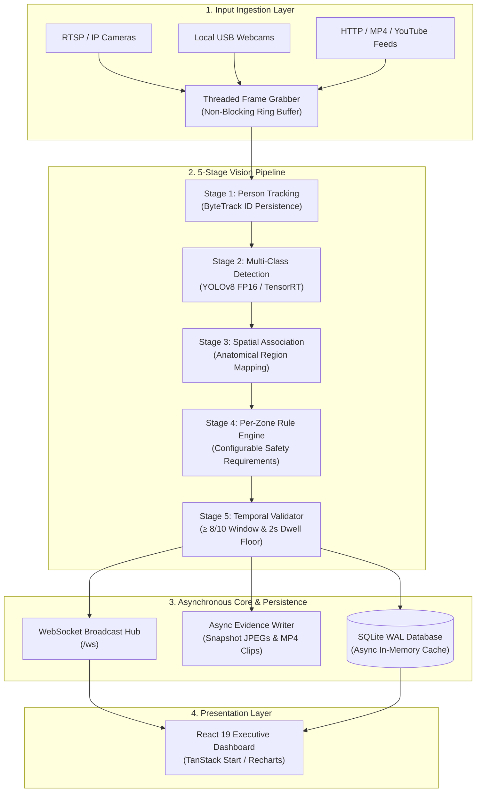
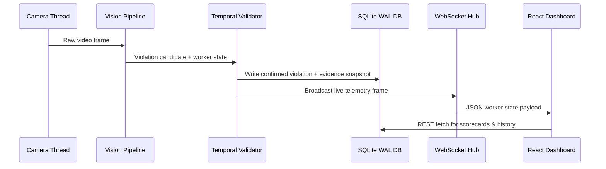

# 🏗️ Cerberus AI — System Architecture & Pipeline Design

> **Repository:** [https://github.com/Vidhyasree14/Cerberus-AI](https://github.com/Vidhyasree14/Cerberus-AI) | **Developer:** Vidhyashree M

Cerberus AI is an industrial edge computer vision platform architected for resilient, multi-camera PPE compliance monitoring. The platform processes continuous video streams through a modular 5-stage inference and temporal verification pipeline, serving low-latency telemetry to a React control room dashboard via FastAPI WebSockets.

---

## 📐 High-Level Architecture



---

## 🧩 Deep Dive: Pipeline Stage-by-Stage

### Stage 1 — Ingestion & Resilient Frame Acquisition (`ThreadedCamera`)

Each camera feed runs as an isolated daemon thread, completely decoupling slow network I/O from GPU inference. Key mechanisms:

| Feature | Description |
| :--- | :--- |
| **Non-Blocking Ring Buffer** | Maintains a fixed-size frame buffer; oldest frames are dropped if inference falls behind |
| **Auto-Recovery Loop** | Automatically handles RTSP packet loss, socket resets, and stream stalls with exponential backoff |
| **Adaptive Frame Rate Decimation** | Implements dynamic frame skipping when GPU or CPU load increases, preserving smooth throughput |
| **Source Support** | USB webcam index, RTSP/RTMP URLs, HTTP MJPEG streams, local MP4 files, YouTube Live URLs |

### Stage 2 — Person Tracking (`ByteTrack`)

ByteTrack provides persistent `Worker-ID` assignment across consecutive frames using:
- **Kalman Filter Motion Prediction:** Predicts worker positions across frames even during brief occlusions.
- **IoU-Based Bounding Box Association:** Associates new detections to existing track IDs using intersection-over-union similarity.
- **Re-ID Recovery:** Recovers previously lost tracks when a worker re-enters the frame after obstruction.

```
Frame N:   Worker-101 [at position A] → ByteTrack → Worker-101 [persistent]
Frame N+5: Worker-101 [occluded]      → ByteTrack → Worker-101 [interpolated]
Frame N+8: Worker-101 [re-visible]    → ByteTrack → Worker-101 [recovered]
```

### Stage 3 — Multi-Class PPE Detection (`YOLOv8`)

- Evaluates full frames and worker-cropped ROIs across **19 industrial object and violation classes**.
- Supports both native **PyTorch FP32/FP16** execution and compiled **TensorRT engines** for sub-15 ms inference latency.
- The model is trained to detect both compliant PPE states (e.g., `Hard_hat`) and explicit violation states (e.g., `No-Helmet`), enabling cross-referenced confidence scoring.

### Stage 4 — Anatomical Spatial Association

Maps detected PPE items to specific worker bounding boxes using body-region anatomical heuristics:

| Body Region | Vertical Proportion | Associated PPE Classes |
| :--- | :---: | :--- |
| **Head Region** | `0.0 – 0.28 × height` | `Hard_hat`, `Mask`, `Glass`, `Ear-Protection` |
| **Torso Region** | `0.25 – 0.65 × height` | `Vest`, Safety Harness |
| **Lower Body / Feet** | `0.65 – 1.0 × height` | `Boots`, `Glove` |

Cross-references positive detections (e.g., `Hard_hat`) against negative states (`No-Helmet`) to produce a definitive per-worker compliance verdict.

### Stage 5 — Per-Zone Rule Engine (`RuleEngine`)

Configurable per-zone compliance matrices define the exact PPE requirements for each operational area:

| Zone Type | Example Required PPE |
| :--- | :--- |
| **General Plant Floor** | `Hard_hat`, `Vest` |
| **Construction Zone** | `Hard_hat`, `Vest`, `Boots`, `Glass` |
| **Work at Height** | `Hard_hat`, `Vest`, `Boots`, `Fire_prevention_Net` |
| **Machinery Floor** | `Hard_hat`, `Vest`, `Ear-Protection`, `Glass` |

### Stage 6 — Temporal Noise Suppression (`TemporalValidator`)

Prevents false alarms caused by lighting glare, transient viewing angles, or brief occlusions:

```
Violation Candidate Timeline:
Frame:   1  2  3  4  5  6  7  8  9  10
State:   V  V  -  V  V  V  V  V  V  V   (V = violation detected, - = not detected)
Count:   8/10 detections = ALERT TRIGGERED ✅

Frame:   1  2  3  4  5  6  7  8  9  10
State:   V  V  -  -  V  -  V  -  V  -   (5/10 — noise suppressed)
Count:   5/10 detections = SUPPRESSED ✗
```

- Requires ≥ **8 out of 10** consecutive frame detections before triggering a formal alert.
- Enforces a minimum **2-second dwell time** before committing violation evidence to the database.

---

## ⚡ Concurrency & Thread Isolation Model

Cerberus AI uses separated `ThreadPoolExecutors` to guarantee disk operations and database writes never starve live inference:

| Executor | Pool Size | Responsibilities |
| :--- | :---: | :--- |
| **`_INFER_EXECUTOR`** | 2–4 workers | YOLOv8 forward passes, ByteTrack state updates |
| **`_IO_EXECUTOR`** | 4–8 workers | JPEG encoding, MP4 evidence generation, database writes |

```
[Camera Stream 1] ───┐
[Camera Stream 2] ───┼──► [_INFER_EXECUTOR] ──► Real-time Detections & Tracking
[Camera Stream N] ───┘                                │
                                                       ▼
                                              [_IO_EXECUTOR] ──► Disk / DB / Evidence
```

---

## 🗄️ Data Flow & Persistence



---

## 🧱 Module Reference

| Module | File | Responsibility |
| :--- | :--- | :--- |
| Frame Grabber | `src/core/detector.py` | Multi-source threaded video acquisition |
| Vision Orchestrator | `src/core/vision_pipeline.py` | 5-stage pipeline coordinator |
| Worker Tracker | `src/core/worker_tracker.py` | ByteTrack ID management & trajectory |
| Rule Engine | `src/core/rule_engine.py` | Per-zone PPE compliance matrix evaluation |
| Temporal Validator | `src/core/temporal_validator.py` | Sliding-window false-alarm suppression |
| Spatial Associator | `src/core/association.py` | Anatomical PPE-to-worker mapping |
| Database Layer | `src/core/db.py` + `sqlite_db.py` | Async WAL persistence & query cache |
| Hardware Telemetry | `src/core/device_telemetry.py` | CPU / RAM / GPU / Jetson metrics |
| WebSocket Publisher | `src/core/publisher.py` | Live broadcast hub for React dashboard |
| FastAPI Server | `src/api/server.py` | REST endpoints + WebSocket `/ws` |

---

*Part of the [Cerberus AI](https://github.com/Vidhyasree14/Cerberus-AI) platform — developed by Vidhyashree M.*
