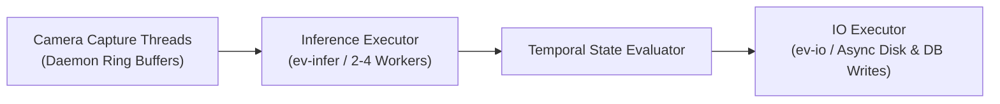

# ⚡ Performance & Multi-Camera Scaling Optimization

This technical specification details the concurrency architecture, memory management, adaptive resolution sizing, and multi-stream scaling strategies implemented in **Cerberus AI**.

---

## 🎯 Multi-Camera Concurrency Architecture

Multi-stream video analytics workloads are typically bound by three primary bottlenecks:
1. **Camera Decoding I/O:** Network latency and packet jitter in RTSP/HTTP decoding.
2. **Inference Compute:** GPU/CPU forward pass throughput.
3. **Storage Latency:** Blocking disk I/O when saving evidence snapshots and MP4 clips.

Cerberus AI resolves these bottlenecks using decoupled asynchronous worker pools:

---

## 📐 Adaptive Resolution Ladder

Inference time scales quadratically with input image dimensions ($O(W \times H)$). As additional cameras are attached, Cerberus AI dynamically adjusts the per-stream inference resolution along an adaptive ladder:

$$\text{Target Size} = \text{snap\_to\_32}\left(\frac{\text{Base Size}}{\sqrt{N_{\text{cameras}}}}\right)$$

| Active Cameras ($N$) | Inference Resolution | Relative Latency | Max Sustainable Aggregate FPS |
| :---: | :---: | :---: | :---: |
| **1 Camera** | $640 \times 640\text{ px}$ | $1.0\times$ (Baseline) | $55.0\text{ FPS}$ |
| **2 Cameras** | $480 \times 480\text{ px}$ | $0.56\times$ | $78.0\text{ FPS}$ |
| **4 Cameras** | $352 \times 352\text{ px}$ | $0.30\times$ | $110.0\text{ FPS}$ |
| **8–16 Cameras** | $288 \times 288\text{ px}$ | $0.20\times$ | $145.0\text{ FPS}$ |

> [!TIP]
> Snapping dimensions to multiples of 32 preserves YOLO convolutional stride alignment and prevents GPU kernel padding overhead.

---

## 📊 Industrial Multi-Camera Sizing & Capacity Engine

In standard industrial safety monitoring, humans move at pedestrian speeds ($\approx 1.2\text{ m/s}$). Evaluating the AI model on every single video frame (30 FPS) per camera is computationally wasteful and limits hardware capacity to 2–3 streams.

Cerberus AI employs an **Asynchronous Tracker-Inference Decoupling** model:
- **ByteTrack Tracker:** Runs at full video frame rate ($30\text{ FPS}$) to maintain smooth trajectory interpolation and visual bounding boxes.
- **YOLO Detector:** Evaluates frames on a sampled interval ($3\text{ FPS}$ to $5\text{ FPS}$ per stream).

### Multi-Stream Capacity on Typical Hardware

$$\text{Max Concurrent Cameras} = \min\left(\left\lfloor \frac{\text{Practical GPU FPS}}{\text{Sampled FPS per Cam}} \right\rfloor, \left\lfloor \frac{\text{Usable VRAM (MB)}}{180\text{ MB / stream}} \right\rfloor\right)$$

| Hardware Platform | GPU / VRAM | Balanced Profile (5 FPS AI) | High-Density (3 FPS AI) | High Speed (10 FPS AI) |
| :--- | :--- | :---: | :---: | :---: |
| **NVIDIA GeForce GTX 1650** | 4 GB GDDR6 | **12 Cameras** | **16 Cameras** | **8 Cameras** |
| **NVIDIA Jetson Orin Nano** | 8 GB LPDDR5 | **14 Cameras** | **18 Cameras** | **10 Cameras** |
| **NVIDIA RTX 3060 / 4060** | 8–12 GB GDDR6 | **24+ Cameras** | **32+ Cameras** | **16 Cameras** |
| **Intel Core i7 (CPU Only)** | 16 GB DDR4 | **6–8 Cameras** | **10–12 Cameras** | **3–4 Cameras** |

---

## 🛠️ Storage & Database Optimization

- **SQLite WAL Mode (`PRAGMA journal_mode=WAL`):** Enables concurrent reads while writes are being committed, eliminating database lock contention during high-frequency violation logging.
- **In-Memory Query Cache (`src/core/cache.py`):** Caches frequent read queries with tag-based invalidation upon new violation insertions.
- **Async Non-Blocking JPEG Encoding:** Evidence snapshot frames are encoded and written to disk inside the dedicated `ev-io` thread pool.
