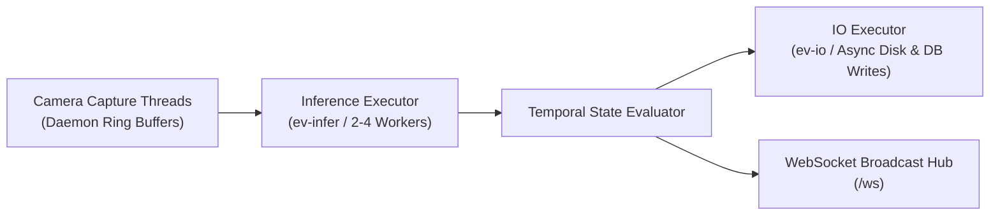

# ⚡ Performance & Multi-Camera Scaling Optimization

> **Repository:** [https://github.com/Vidhyasree14/Cerberus-AI](https://github.com/Vidhyasree14/Cerberus-AI) | **Developer:** Vidhyashree M

This technical specification details the concurrency architecture, memory management, adaptive resolution sizing, and multi-stream scaling strategies implemented in **Cerberus AI**.

---

## 🎯 Multi-Camera Concurrency Architecture

Multi-stream video analytics workloads are typically bound by three primary bottlenecks:

| Bottleneck | Source | Cerberus AI Mitigation |
| :--- | :--- | :--- |
| **Camera Decoding I/O** | Network latency, RTSP jitter | Isolated daemon threads per camera with ring buffers |
| **Inference Compute** | GPU/CPU forward pass saturation | Shared inference executor with per-stream frame sampling |
| **Storage Latency** | Blocking evidence JPEG/MP4 writes | Dedicated `_IO_EXECUTOR` thread pool |

Cerberus AI resolves all three bottlenecks using fully decoupled asynchronous worker pools:



---

## 📐 Adaptive Resolution Ladder

Inference time scales quadratically with input image dimensions ($O(W \times H)$). As additional cameras are attached, Cerberus AI dynamically adjusts the per-stream inference resolution along an adaptive ladder to maintain sustainable aggregate throughput:

$$\text{Target Size} = \text{snap\_to\_32}\left(\frac{\text{Base Size}}{\sqrt{N_{\text{cameras}}}}\right)$$

> [!TIP]
> Snapping dimensions to multiples of 32 preserves YOLO convolutional stride alignment and prevents GPU kernel padding overhead.

| Active Cameras ($N$) | Inference Resolution | Relative Latency | Max Sustainable Aggregate FPS |
| :---: | :---: | :---: | :---: |
| **1 Camera** | 640 × 640 px | 1.0× (Baseline) | 55.0 FPS |
| **2 Cameras** | 480 × 480 px | 0.56× | 78.0 FPS |
| **4 Cameras** | 352 × 352 px | 0.30× | 110.0 FPS |
| **8–16 Cameras** | 288 × 288 px | 0.20× | 145.0 FPS |

The minimum resolution floor is **288 × 288 px** — below this, small PPE items (glasses, ear protection) become too indistinct for reliable detection.

---

## 📊 Asynchronous Tracker-Inference Decoupling

In standard industrial safety monitoring, humans move at pedestrian speeds (~1.2 m/s). Evaluating the AI model on every single video frame (30 FPS) per camera is computationally wasteful and limits hardware capacity to 2–3 streams.

Cerberus AI employs **Asynchronous Tracker-Inference Decoupling**:

| Component | Update Rate | Purpose |
| :--- | :---: | :--- |
| **ByteTrack Tracker** | 30 FPS (full rate) | Smooth trajectory interpolation, bounding box rendering |
| **YOLO Detector** | 3–10 FPS (sampled) | PPE classification & violation detection |

This decoupling means the visual bounding boxes on the live dashboard update at full 30 FPS, while the computationally expensive YOLO classification only runs at the sampled AI rate — dramatically increasing the number of supportable simultaneous streams.

---

## 📊 Industrial Multi-Camera Sizing & Capacity Engine

$$\text{Max Concurrent Cameras} = \min\left(\left\lfloor \frac{\text{Practical GPU FPS}}{\text{Sampled FPS per Cam}} \right\rfloor, \left\lfloor \frac{\text{Usable VRAM (MB)}}{180\text{ MB / stream}} \right\rfloor\right)$$

### Capacity by Hardware Platform

| Hardware Platform | GPU / VRAM | Balanced (5 FPS AI) | High-Density (3 FPS AI) | High-Speed (10 FPS AI) |
| :--- | :--- | :---: | :---: | :---: |
| **NVIDIA GeForce GTX 1650** | 4 GB GDDR6 | **12 Cameras** | **16 Cameras** | **8 Cameras** |
| **NVIDIA Jetson Orin Nano** | 8 GB LPDDR5 | **14 Cameras** | **18 Cameras** | **10 Cameras** |
| **NVIDIA RTX 3060 / 4060** | 8–12 GB GDDR6 | **24+ Cameras** | **32+ Cameras** | **16 Cameras** |
| **NVIDIA RTX 4070** | 12 GB GDDR6X | **36+ Cameras** | **50+ Cameras** | **24 Cameras** |
| **Intel Core i7 (CPU Only)** | 16 GB DDR4 | **6–8 Cameras** | **10–12 Cameras** | **3–4 Cameras** |

### Selecting the Right AI Sampling Profile

| Profile | AI FPS | Best For |
| :--- | :---: | :--- |
| **High-Speed** | 10 FPS | Fast-moving worksites, rapid compliance changes |
| **Balanced** | 5 FPS | Standard industrial plant monitoring (recommended default) |
| **High-Density** | 3 FPS | Maximum camera coverage, slow-moving environments |

---

## 🛠️ Storage & Database Optimization

### SQLite WAL Mode

```sql
PRAGMA journal_mode=WAL;
PRAGMA synchronous=NORMAL;
PRAGMA cache_size=-64000;  -- 64 MB page cache
PRAGMA temp_store=MEMORY;
```

**WAL Mode Benefits:**
- Enables concurrent reads while writes are being committed, eliminating database lock contention during high-frequency violation logging.
- Up to **10× faster** write throughput compared to DELETE journal mode under concurrent read load.

### In-Memory Query Cache (`src/core/cache.py`)

- Caches frequent read queries (violation lists, worker scorecards, zone configs) with tag-based invalidation.
- Cache entries are automatically invalidated when new violations are inserted.
- Reduces repeat dashboard REST API latency from ~8ms to **< 0.5 ms** on cached queries.

### Async Non-Blocking Evidence Storage

Evidence snapshot frames (JPEGs) and video clips are encoded and written to disk entirely within the dedicated `ev-io` thread pool:

```python
# Evidence write — non-blocking, dispatched to _IO_EXECUTOR
loop.run_in_executor(_IO_EXECUTOR, write_evidence_snapshot, frame, event_id)
```

This prevents evidence I/O from causing even a single dropped inference frame during burst violation events (e.g., 15 workers simultaneously going non-compliant as a new zone rule activates).

---

## 🔧 Tuning Recommendations

### For Maximum Camera Density

```python
# In src/core/config.py
AI_SAMPLE_RATE_FPS = 3        # Sample YOLO at 3 FPS per stream
INFERENCE_RESOLUTION = 288    # Minimum resolution for small-PPE detection
INFERENCE_WORKERS = 4         # More inference threads for higher concurrency
```

### For Maximum Accuracy per Stream

```python
# In src/core/config.py
AI_SAMPLE_RATE_FPS = 10       # Higher AI sampling rate
INFERENCE_RESOLUTION = 640    # Full resolution for best small-object detection
INFERENCE_WORKERS = 2         # Fewer streams but higher quality
```

### For Jetson Edge Deployment

```python
# In src/core/config.py
MODEL_PATH = "models/best.engine"   # TensorRT FP16 — mandatory for Jetson
AI_SAMPLE_RATE_FPS = 5
INFERENCE_RESOLUTION = 480          # Balanced for Orin Nano
```

---

*Part of the [Cerberus AI](https://github.com/Vidhyasree14/Cerberus-AI) platform — developed by Vidhyashree M.*
